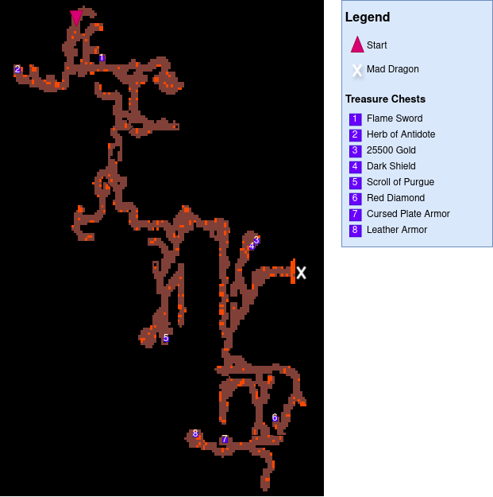
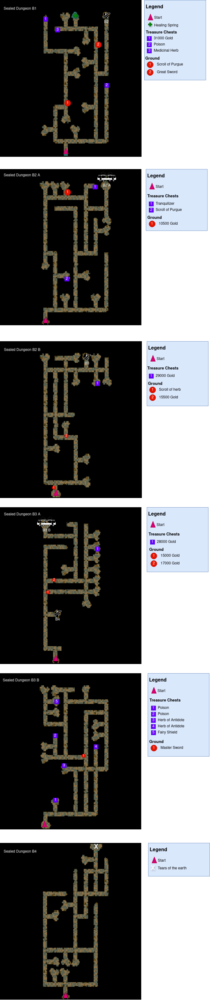
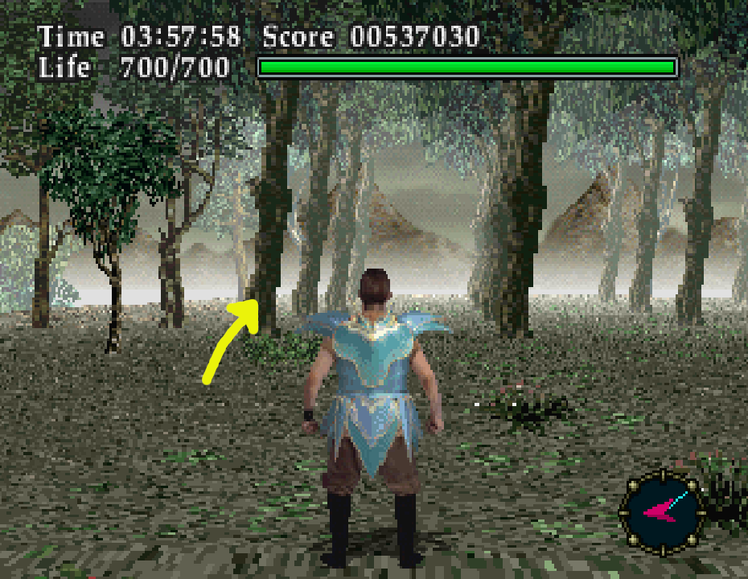
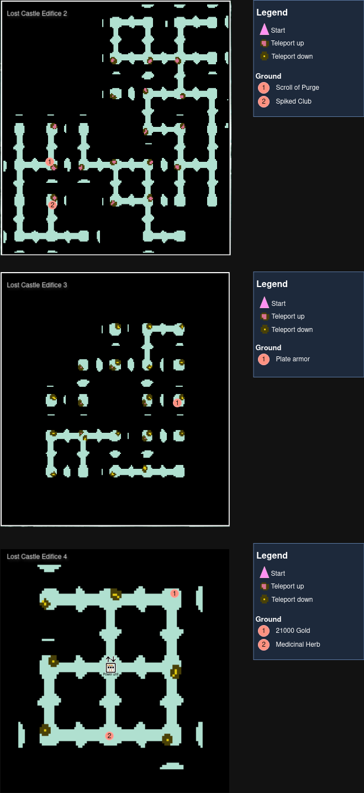
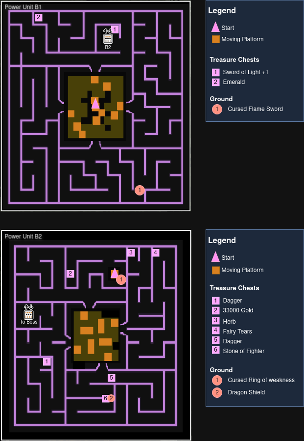
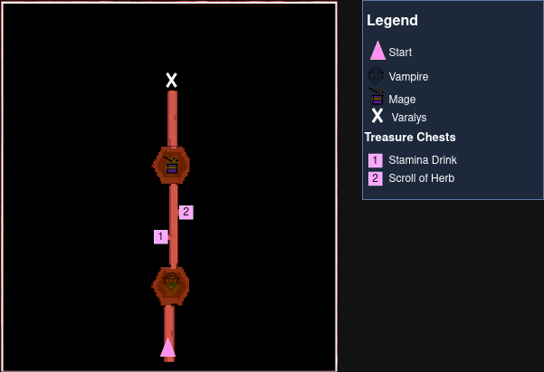

# MARIOPARTY Hard
The purpose of this guide is to document the items i've found while exploring Hydlide using the **MARIOPARTY** Seed on Hard Difficulty.

Most of the choices made in this guide were informed by:
- Retroachievement's guide by Cykkette: https://github.com/RetroAchievements/guides/wiki/Virtual-Hydlide
- Mechalink's Speedrun Guide: https://docs.google.com/document/d/1oGy78nvTUnASmYIBs0UDbFk8AOQW6YOnm12f0UBxeGQ

This is a work in progress, if you find anything that's not documented please open an issue

# Changes in Hard Difficulty
As per Mechalink's [guide](https://docs.google.com/document/d/1oGy78nvTUnASmYIBs0UDbFk8AOQW6YOnm12f0UBxeGQ) :
- You start with nothing
- The map turns into a self-mapping feature, where it will appear on the map once you enter the chunk
- The blue compass no longer directs you until you have exposed the destination on the map
- The shop is no longer available.
    - Due to this, the starting location is different from Easy and Normal.
- Leveling only restores as much health as you gain.
- Enemy defense is increased enough to make some enemies that could be stunned become near-unstunnable.
    - Wizard/Evil Mage does not get stunned, so prepare to block multiple volleys. You can sneak in a hit between volleys if you’re fast.
- Water healing spots in the Mines appear gone (Lvl 4 and Lvl 5 on verified)

# General Tips
- If you die on a dungeon and select continue you'll warp back to the entrance. Since enemies on hard hit like a truck Deathwarping is pretty fast.
- The first 3 locations are optional but I recomend at least doing a run through the graveyard and the trial dungeon.
- Jim has the turning radius of a cruise ship, That being said you can turn fast and with precission in the map screen.
- Enemies swarming you? Save and load to despawn them.

# Locations

## 0. Overworld

## 1. Graveyard
___Time to deface some graves___

There's not much to the graveyard, pick all the items that you need and book it.

### Important items
- **Crucifix**: Needed to hurt the vampire if you're not carrying the Master Sword or the Sword of Light.
- **Amethyst**: Used in conjunction with the Emerald and Red Diamond to turn the final boss teleports into a visible teleport.
- **Dark Sword**: Press **B+C** to shoot an energy ball, useful against Mad Dragon.
- **Stamina Drink**

## 2. Vampire's Mansion (Optional)
___Welcome to the only house in Hydlide___

Beating the vampire is optional since the Lamp is not required in any place(just helps seeing).

IF you're going for the no damage achievement, it's better to leave it alone until after collecting the fairy in the fairy forest, by that point in the game the vampire can't hurt you.

### Important items
- **Magic lamp / Super Magic Lamp**: dropped by beating the vampire.
- **Tranquilizer**: Cures Panic status effect (inflicted by mimics on later parts of the game)
- **Leather Armor**: Better than nothing
- **Medicinal Herb/Scroll of Herb**

## 3. Trial Dungeon
___Careful with the sparks___

### Important items
- **Dragon Shield**: Best shield to keep equiped as it blocks projectile attacks from Mad Dragon, Wizard and Varalys (Final boss)
- **Spectacles of Truth**: Allows you to see hidden walls (needed to get the 2 chests in the final dungeon)

## 4. Ruins 
___Entrance right next to the sign___

The ruins are home to the best armor in the game and the 2 more useful swords.

If you hug the walls you will avoid the pressure plates that trigger the spike traps. Try to not idle by the spawners or you'll get swarmed by ropers.

It's best to keep the Magic Sword and the Master Sword around for their use commands at least until the Fairy Shield comes.

### Important items
- **Flame Amulet**: Avoids Jim turning into a crisp when walking over lava in the volcano
- **Fairy armor**: Highest defense in the game
- **Master Sword**: 4rd Best Sword, does Holy damage. Can be used in menu to cure curses.
- **Magic Sword**: Can be used in menu to cure poison.
- **Scroll of Oracle**: Reveals the whole map of a dungeon

## 5. Volcano
___Home of the Pink Knights___

The loot in the volcano ain't that great, use map turning to avoid getting lost.

The boss, Mad Dragon always announces it's attacks by roaring and lowering it's head. Defend with the Dragon shield and then shoot back with the Dark Sword.

Take off the flame amulet and touch any lava on the floor to deathwarp instantly to the entrance.

### Important items
- **Flame Sword**: 3rd Best Sword in the game, **B+C** to shoot a fireball. Useful against the Mage in the Sealed Ruins.
- **Red Diamond**: Used in conjunction with the Emerald and Amethyst to turn the final boss teleports into a visible teleport 
- **Flute of Zaldus**: Required to open the door to the sealed ruins. Obtained from beating Mad Dragon.

## 6. Sealed Dungeon
___Don't trust the signs___

B1 is home to mimics, don't be tricked while treasure hunting.

The cart rides state you need to weight <5 Kg, but the check ain't programmed 

This dungeon doesn't have any useful loot aside from the fairy shield so it's better to head straight for it then beat the mage!

### Important items
- **Fairy Shield**: Has the strongest defense in the game. Use it in the menu to heal Poison, Curse and paralysis.

## 7. Fairy Forest
___Not the 🐝🐝!___

Technically you can collect this fairy since the beginning of the game, though that may mess up where the items show up in later dungeons.

I recommend picking it up right before the lost castle so you'll get teleported to the last dungeon instantly.

To get the fairy **bump** the leftmost tree looking to the west as shown in the picture.

## 8. Lost Castle
___Crystals and platforms___

This dungeon is divided between the Edifice and the Power Unit.

### 8.1 Edifice
___Hydlide's Silph Co.___

The first part of this dungeon is a teleporter maze, lucky enough it's pretty easy. 

Pink platforms take you a level above and the yellow platforms to a level below.

The goal is to get to the center of the 4th floor, you can't really miss it!

#### Important items
- None

### 8.2. Power unit
___Welcome to mazee's___

The power unit is made of moving platforms in the center, and 4 mazes surrounding all cardinal directions.

Inside the maze there's elevators connecting B1 to B2, and you can go back to B1 if you forget something.

Once you enter the boss chamber you're locked in, so be careful.

#### Important items
- **Sword of light**: Best weapon in the game, needed to beat the next bosses. Use both attacks to shoot homing light orbs.
- **Emerald**: The last of the trifecta. Used in conjunction with the Red diamond and Amethyst to turn the final boss teleports into a visible teleport.
- **Stone of fighter**: Equip it to make the sword of light shoot three orbs! It will chew through the next bosses HP Bar.

## 9. Final dungeon
___One last meaty corridor___

A corridor with three chambers, the first two are refights against the vampire and the mage.

Though if you have the __stone of fighter__ equipped they won't pose much of a threat!

The corridor to the mage contains two final chests hidden behind illusory walls, to access them use the __Spectacles of truth__

