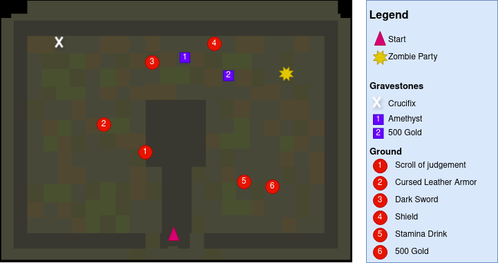
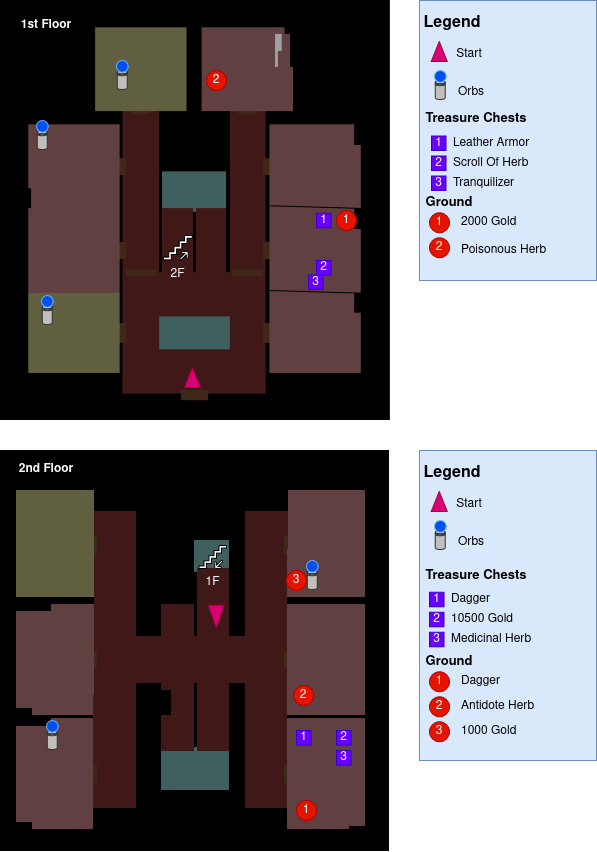

# MARIOPARTY Hard
The purpose of this guide is to document the items i've found while exploring Hydlide using the **MARIOPARTY** Seed on Hard Difficulty.

Most of the choices made in this guide were informed by:
- Retroachievement's guide by Cykkette: https://github.com/RetroAchievements/guides/wiki/Virtual-Hydlide
- Mechalink's Speedrun Guide: https://docs.google.com/document/d/1oGy78nvTUnASmYIBs0UDbFk8AOQW6YOnm12f0UBxeGQ

This is a work in progress, if you find anything that's not documented please open an issue

# Changes in Hard Difficulty
As per Mechalink's [guide](https://docs.google.com/document/d/1oGy78nvTUnASmYIBs0UDbFk8AOQW6YOnm12f0UBxeGQ) :
- You start with nothing
- The map turns into a self-mapping feature, where it will appear on the map once you enter the chunk
- The blue compass no longer directs you until you have exposed the destination on the map
- The shop is no longer available.
    - Due to this, the starting location is different from Easy and Normal.
- Leveling only restores as much health as you gain.
- Enemy defense is increased enough to make some enemies that could be stunned become near-unstunnable.
    - Wizard/Evil Mage does not get stunned, so prepare to block multiple volleys. You can sneak in a hit between volleys if you’re fast.
- Water healing spots in the Mines appear gone (Lvl 4 and Lvl 5 on verified)

# General Tips
- If you die on a dungeon and select continue you'll warp back to the entrance. Since enemies on hard hit like a truck Deathwarping is pretty fast.
- The first 3 locations are optional but I recomend at least doing a run through the graveyard and the trial dungeon.

# Locations

## 0. Overworld

## 1. Graveyard

### Important items
- Crucifix: Needed to hurt the vampire if you're not carrying the Master Sword or the Sword of Light.
- Amethyst: Used in conjunction with the Emerald and Red Diamond to turn the final boss teleports into a visible teleport.
- Dark Sword: Projectile weapon, useful early on against Mad Dragon
- Stamina Drink

## 2. Vampire's Mansion (Optional)
_Welcome to the only house in Hydlide_

Beating the vampire is optional since the Lamp is not required in any place(just helps seeing).
You can always come back here when you're better equiped for some easy experience.

### Important items
- Magic lamp / Super Magic Lamp: dropped by beating the vampire.
- Tranquilizer: Cures Panic status effect (inflicted by mimics on later parts of the game)
- Leather Armor: Better than nothing
- Medicinal Herb/Scroll of Herb

## 3. Trial Dungeon
_Careful with the sparks_

### Important items
- Dragon Shield: Best shield to keep equiped as it blocks projectile attacks from Mad Dragon, Wizard and Varalys (Final boss)
- Spectacles of Truth: Allows you to see hidden walls (needed to get the 2 chests in the final dungeon)

## 4. Ruins 
_Entrance right next to the sign_

The ruins are home to the best armor in the game and the 2 more useful swords.

If you hug the walls you will avoid the pressure plates that trigger the spike traps. Try to not idle by the spawners or you'll get swarmed by ropers.

It's best to keep the Magic Sword and the Master Sword around for their use commands at least until the Fairy Shield comes.

### Important items
- Flame Amulet: Avoids Jim turning into a crisp when walking over lava in the volcano
- Fairy armor: Highest defense in the game
- Master Sword: 3rd Best Sword, does Holy damage. Can be used in menu to cure curses.
- Magic Sword: Can be used in menu to cure poison.
- Scroll of Oracle: Reveals the whole map of a dungeon